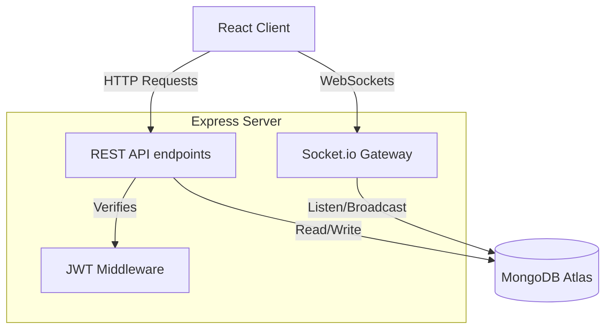
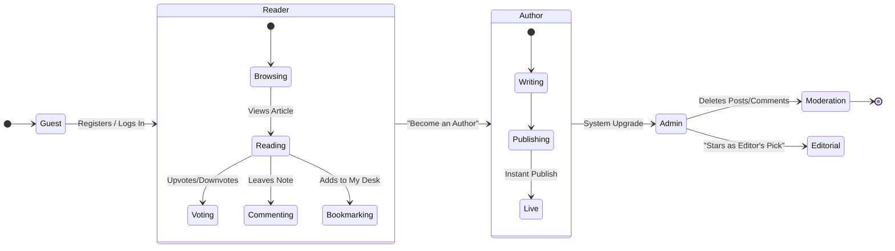

<div align="center">
  

  <br />
  <br />

  <h1>🗞️ The Chronicle</h1>
  
  <p>
    <b>A sophisticated, full-stack MERN blog platform blending the rich, long-form editorial aesthetic of traditional newspapers with the dynamic community engagement of modern forums.</b>
  </p>

  <p>
    <a href="#features">Features</a> •
    <a href="#tech-stack">Tech Stack</a> •
    <a href="#installation">Installation</a> •
    <a href="#deployment">Deployment</a>
  </p>
  
  <p>
    
    
    
    
    
  </p>
</div>

---

## ✨ Overview

Welcome to **The Chronicle**. This project is a fully-featured, production-ready web application designed for learning and demonstrating advanced full-stack development techniques. 

Instead of relying on boilerplate UI libraries like Bootstrap or Tailwind, The Chronicle features a **100% custom-built, vanilla CSS design system** meticulously crafted to look like a premium digital broadsheet. It flawlessly combines high-end editorial layouts with real-time community interaction.

---

## 🚀 Key Features

### 📰 The Editorial Experience
* **Digital Broadsheet Aesthetic:** A beautiful, custom-coded newspaper grid layout using modern CSS Flexbox and Grid.
* **Smart Dark Mode:** A sophisticated dark theme with carefully selected muted colors, ink-like image shadows, and fluid CSS transitions that remembers user preferences.
* **Editor's Picks:** Admins can feature "Cover Stories" and highlight top-tier journalism on the homepage.
* **Premium Typography:** Utilizes carefully paired serif and sans-serif Google Fonts for maximum literary readability.
* **Markdown Support:** Full support for rich-text parsing in writing articles using `react-markdown`.

### 👥 Community & Engagement (Reddit-Style)
* **Dynamic User Roles:** Three distinct permission levels:
  * 🛡️ **Admin:** Full control over content moderation and UI featuring.
  * ✒️ **Author:** Can visually identify themselves, write, publish, and manage their own stories.
  * 👤 **Reader:** Can engage with content, vote, and instantly self-upgrade to Author status.
* **Voting System:** An elegant "Upvote & Downvote" system for both overarching articles and individual comments to surface the absolute best content to the top.
* **Real-time Correspondence:** Engage in vivid discussions with multi-threaded, live-updating comment sections powered completely by **Socket.io**.
* **Personal Bookmarks ("My Desk"):** Users can save and curate their favorite articles to visually stunning personal dashboards.

### 🔒 Security & Architecture
* **JSON Web Tokens (JWT):** Secure, scalable, stateless storage-based authentication.
* **Password Hashing:** Robust cryptographic hashing via `bcryptjs`.
* **REST API:** Clean, structured backend controllers with robust Mongoose validation schemas.
* **SEO Optimized:** Dynamic meta tags and titles actively generated per article using `react-helmet-async`.

---

## 🗺️ Application Architecture & User Flow

The Chronicle employs a robust MERN stack architecture with real-time capabilities. Here is how data moves through the application:



### 🧑‍💻 Complete User Flow

The platform heavily relies on dynamic User Roles. Below is the lifecycle of a user progressing through the application:



---

## 🛠️ Tech Stack Architecture

**Frontend:**
- React.js (Vite)
- React Router DOM v6
- Axios (API Client)
- Custom Vanilla CSS (Zero UI Frameworks!)
- Socket.io-Client (Real-time updates)
- Material Symbols (Icons)

**Backend:**
- Node.js & Express.js
- MongoDB & Mongoose ORM
- JSON Web Token (JWT)
- Socket.io (WebSockets)
- bcryptjs (Cryptography)

---

## 💻 Local Installation & Setup

### Prerequisites
1. **Node.js** (v16.0 or higher)
2. **MongoDB** (Local instance or an Atlas cluster URL)

### 1. Clone the Repository
```bash
git clone https://github.com/afzalkhanofficial/The-Chronicle.git
cd The-Chronicle
```

### 2. Configure the Backend (Server)
Open a new terminal window:
```bash
cd server
npm install
```
Create a `.env` file inside the `/server` directory:
```env
PORT=5000
MONGODB_URI=mongodb://127.0.0.1:27017/chronicle_db
JWT_SECRET=your_super_secret_jwt_key_here
JWT_EXPIRE=30d
CLIENT_URL=http://localhost:5173
```
Start the server:
```bash
npm run dev
```

### 3. Configure the Frontend (Client)
Open a second terminal window:
```bash
cd client
npm install
```
Create a `.env` file inside the `/client` directory:
```env
VITE_API_URL=http://localhost:5000/api
VITE_SOCKET_URL=http://localhost:5000
```
Start the client application:
```bash
npm run dev
```

The application will now be running smoothly at `http://localhost:5173`! 🚀

---

## 📂 Project Structure

A quick look at how the MERN architecture is cleanly separated and organized:

```text
the-chronicle/
├── client/                     # React Frontend Workspace
│   ├── public/                 # Static assets
│   ├── src/
│   │   ├── components/         # Reusable UI (Navbar, PostCards, etc.)
│   │   ├── context/            # React Context API (AuthContext)
│   │   ├── pages/              # Main view components (Home, Profile, Admin)
│   │   ├── utils/              # Axios & Socket.io instances
│   │   └── index.css           # 100% Custom Design System
│   └── package.json
│
└── server/                     # Node/Express Backend Workspace
    ├── config/                 # Database connection logic
    ├── controllers/            # Route business logic handling
    ├── middleware/             # Role verification & JWT auth
    ├── models/                 # Mongoose Database Schemas
    ├── routes/                 # Express API Endpoints
    ├── server.js               # Application Entry Point & WebSockets setup
    └── package.json
```

---

## 🌐 Deployment to Production

Deploying this multi-tier application is straightforward. You will need to host three separate services:
1. The Database on **MongoDB Atlas**
2. The Backend on **Render.com** 
3. The Frontend on **Vercel**

Please refer closely to the **`deployment_guide.md`** file for comprehensive step-by-step instructions on pushing your code securely onto the internet for free!

---

## 🙏 Acknowledgements

* **Typography:** [Playfair Display](https://fonts.google.com/specimen/Playfair+Display) and [Libre Franklin](https://fonts.google.com/specimen/Libre+Franklin).
* **Images:** Default placeholders provided by Unsplash and Dicebear Avatars.

<div align="center">
  <br />
  <p>Built with ❤️ as a sophisticated MERN stack learning project.</p>
  
</div>
